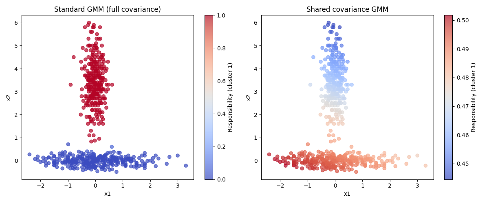

# Exercise 3: Two Gaussians

## Code

```python
import numpy as np
import matplotlib.pyplot as plt
import sys
sys.path.insert(0, '.')

from em import computeresponsibilities, computeparameters, computeparameterssame, em

# Load data
X = np.loadtxt('2gaussians.txt')

# Initialize responsibilities randomly
np.random.seed(42)
N = X.shape[0]
K = 2
R_init = np.random.rand(N, K)
R_init = R_init / R_init.sum(axis=1)[:, np.newaxis]

# Standard mixture model
R1_final, prior1, mu1, C1 = em(X, R_init.copy(), 100, computeparameters)

# Shared covariance model
R2_final, prior2, mu2, C2 = em(X, R_init.copy(), 100, computeparameterssame)

# Plot
fig, axes = plt.subplots(1, 2, figsize=(12, 5))

sc1 = axes[0].scatter(X[:, 0], X[:, 1], c=R1_final[:, 0], cmap='coolwarm', alpha=0.7)
axes[0].set_title('Standard GMM (full covariance)')
axes[0].set_xlabel('x1')
axes[0].set_ylabel('x2')
plt.colorbar(sc1, ax=axes[0], label='Responsibility (cluster 1)')

sc2 = axes[1].scatter(X[:, 0], X[:, 1], c=R2_final[:, 0], cmap='coolwarm', alpha=0.7)
axes[1].set_title('Shared covariance GMM')
axes[1].set_xlabel('x1')
axes[1].set_ylabel('x2')
plt.colorbar(sc2, ax=axes[1], label='Responsibility (cluster 1)')

plt.tight_layout()
plt.savefig('answer3.png')
plt.show()
print("Saved answer3.png")
```

## Plots



## Explanation

**Standard GMM (left):** The model assigns responsibilities close to 0 or 1 for almost all points — the two clusters are cleanly separated. The upper vertical cluster (around x1 ≈ 0, x2 ∈ [1, 6]) is assigned entirely to cluster 1 (red), and the horizontal cluster (x2 ≈ 0, spread across x1) is assigned entirely to cluster 2 (blue). This is possible because each cluster has its **own full covariance matrix**, so cluster 1 can learn a tall narrow shape (small variance in x1, large in x2) and cluster 2 can learn a wide flat shape (large variance in x1, small in x2). The model fits the true geometry of each cluster independently.

**Shared covariance GMM (right):** The responsibilities are all very close to 0.5 — the colorbar ranges only from 0.45 to 0.50, meaning the model is nearly unable to distinguish the two clusters. Because both clusters are **forced to share the same covariance matrix**, the single shared matrix must compromise between the tall-narrow shape of one cluster and the wide-flat shape of the other. The resulting covariance fits neither well, so the model cannot confidently assign points to one cluster or the other.

**Conclusion:** When clusters have very different shapes, constraining them to share a covariance matrix severely limits the model's expressive power. The shared covariance is a poor fit for both clusters simultaneously, leading to near-uniform responsibilities and effectively a failed separation.